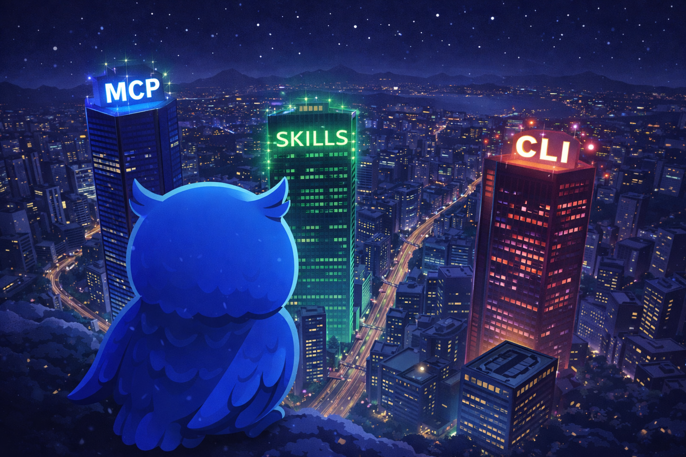
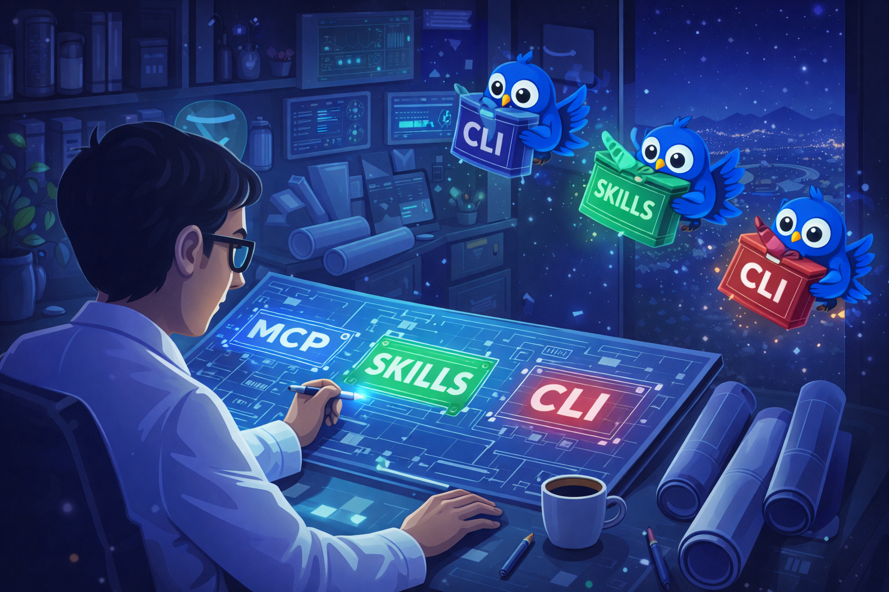

<div align="center">


# Clarvia

**AEO (Agent Engine Optimization) Scanner for AI Agent Tools**

Score, discover, and validate 12,800+ AI agent tools for quality, accessibility, and agent-readiness.

[](https://www.npmjs.com/package/clarvia-mcp-server)
[](LICENSE)
[](https://clarvia.art)
[](#)
[](https://clarvia.art)

</div>

---

## What is Clarvia?

Clarvia assigns an **AEO Score (0-100)** to any AI tool, API, or MCP server -- measuring how easily AI agents can discover, integrate, and trust it. Think of it as a "Lighthouse for AI agent tools."

**4 scoring dimensions** (25 points each):

| Dimension | What it measures |
|---|---|
| **API Accessibility** | Endpoint existence, response speed, auth documentation |
| **Data Structuring** | Schema definition, pricing clarity, error structure |
| **Agent Compatibility** | MCP server presence, robots.txt, sitemap/discovery |
| **Trust Signals** | Uptime, documentation quality, update frequency |

Plus an optional **Onchain Bonus (+25)** for web3 services.

---

## For Agents



> *"Before calling any external tool, check if it's agent-ready."*

Clarvia gives your agent a **quality gate** for tool selection. Instead of blindly calling APIs, your agent can:

1. **Gate-check** a tool before use -- get a pass/fail verdict with an agent grade (`AGENT_NATIVE` / `AGENT_FRIENDLY` / `AGENT_POSSIBLE` / `AGENT_HOSTILE`)
2. **Find alternatives** when a tool fails the check -- automatically discover higher-rated options in the same category
3. **Report outcomes** after using a tool -- contribute to community-driven reliability data
4. **Probe live** -- verify a service is reachable and responsive right now, before committing to a call

```
Agent workflow:
  Need a payment API?
  -> search_services("payment API")
  -> gate_check(top_result)
  -> PASS? Use it. FAIL? find_alternatives("payment")
  -> After use: submit_feedback(result)
```

## For Tool Makers



> *"See your tool the way AI agents see it."*

If you build APIs, MCP servers, or developer tools, Clarvia shows you:

- **Your AEO score** -- how agent-ready your tool is today
- **Specific gaps** -- missing OpenAPI spec? No MCP server? Poor error messages?
- **Category ranking** -- how you compare to alternatives in your space
- **Actionable fixes** -- each scoring dimension tells you exactly what to improve

Register your service and get indexed across the Clarvia directory, making it discoverable by every agent that uses Clarvia.

---

## Quick Start

### Option 1: npx (recommended)

```bash
npx clarvia-mcp-server
```

### Option 2: Remote MCP endpoint

```
https://clarvia-api.onrender.com/mcp/
```

Use this URL directly in any MCP client that supports remote servers (Streamable HTTP).

### Option 3: pip (coming soon)

```bash
pip install clarvia-langchain
```

---

## MCP Client Configuration

<details>
<summary><strong>Claude Desktop</strong></summary>

Add to `~/Library/Application Support/Claude/claude_desktop_config.json`:

```json
{
  "mcpServers": {
    "clarvia": {
      "command": "npx",
      "args": ["clarvia-mcp-server"]
    }
  }
}
```

</details>

<details>
<summary><strong>Claude Code</strong></summary>

```bash
claude mcp add clarvia -- npx clarvia-mcp-server
```

</details>

<details>
<summary><strong>Cursor / Windsurf</strong></summary>

Add to `.cursor/mcp.json` or `.windsurf/mcp.json`:

```json
{
  "mcpServers": {
    "clarvia": {
      "command": "npx",
      "args": ["clarvia-mcp-server"]
    }
  }
}
```

</details>

<details>
<summary><strong>Any MCP client (Remote URL)</strong></summary>

Point your client at the remote endpoint:

```
https://clarvia-api.onrender.com/mcp/
```

No local installation required.

</details>

---

## MCP Tools Reference

| Tool | Description |
|------|-------------|
| `search_services` | Search 12,800+ indexed AI tools by keyword, category, or minimum score |
| `scan_service` | Run a full AEO audit on any URL |
| `get_service_details` | Get detailed scoring breakdown for a scanned service |
| `list_categories` | List all tool categories with service counts |
| `get_stats` | Get platform-wide statistics (averages, distributions) |
| `register_service` | Submit a new service for indexing and scoring |
| `clarvia_gate_check` | Quick pass/fail safety check before using a tool |
| `clarvia_batch_check` | Batch-check up to 10 URLs in one call |
| `clarvia_find_alternatives` | Find higher-rated alternatives in a category |
| `clarvia_probe` | Live accessibility probe (HTTP, latency, OpenAPI, MCP) |
| `clarvia_submit_feedback` | Report tool usage outcomes to improve reliability data |

---

## REST API

The scanner backend also exposes a REST API:

| Method | Endpoint | Description |
|--------|----------|-------------|
| `POST` | `/api/scan` | Run a scan (`{"url": "stripe.com"}`) |
| `GET` | `/api/scan/{scan_id}` | Get cached scan result |
| `POST` | `/api/waitlist` | Join waitlist |
| `GET` | `/health` | Health check |

Rate limits: **10 scans/hour** (free) or **100 scans/hour** (with `X-API-Key` header).

---

## Architecture

```
scanner/
  backend/           # FastAPI (Python 3.12+)
    app/
      checks/        # 13 scoring sub-factors
      routes/        # API endpoints
      services/      # Supabase + PDF generation
  frontend/          # Next.js + Tailwind
  mcp-server/        # MCP server (Node.js, TypeScript)
```

## Development

```bash
# Backend
cd backend && pip install -r requirements.txt
uvicorn app.main:app --reload --port 8000

# Frontend
cd frontend && npm install && npm run dev

# MCP Server
cd mcp-server && npm install && npm run dev

# Docker (full stack)
docker compose up --build
```

---

## Links

- **Website**: [clarvia.art](https://clarvia.art)
- **MCP Registry**: `io.github.digitamaz/clarvia`
- **npm**: [clarvia-mcp-server](https://www.npmjs.com/package/clarvia-mcp-server)

## License

[MIT](LICENSE)
